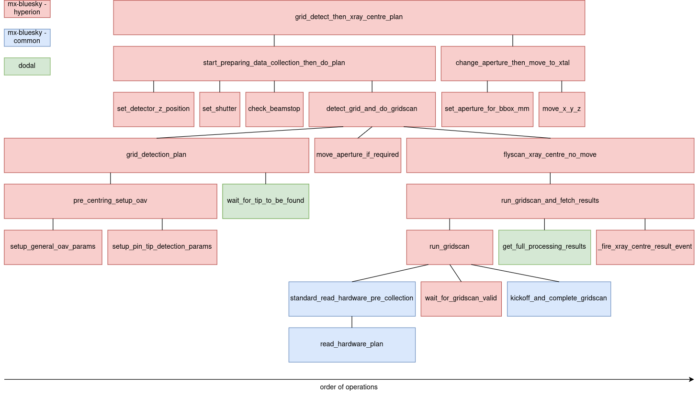

The aim of this page is to provide a general overview of the Hyperion `grid_detect_then_xray_centre_plan` plan.

## src/mx-bluesky/hyperion/

This is the location of most of the code for the `grid_detect_then_xray_centre_plan` plan. Some code is located in `mx-bluesky/common` and [dodal](https://github.com/DiamondLightSource/dodal), and plans are increasingly being generalised and moved into `mx-bluesky/common` where possible. Therefore the structure of the codebase is subject to change and this document should be updated accordinly.

There are then a number of plans that make up the `grid_detect_then_xray_centre_plan` plan. Some important ones:
* [`grid_detection_plan`](#flyscan-xray-centre) - Use the OAV to optically calculates a grid for a scan that would cover the whole sample
* [`flyscan_xray_centre_plan`](#flyscan-xray-centre) - triggers a hardware-based grid scan and moves to the xray centre as returned from `zocalo`

* [`grid_detect_then_xray_centre_plan`](#grid-detect-then-xray-centre) performs an [OAV grid detection](#oav-grid-detection) then a [flyscan xray centre](#flyscan_xray_centre_plan)

The diagram below shows all the plans that make up the `grid_detect_then_xray_centre_plan` plan. The colors indicate where these plans can be found.

### Grid Detect Then Xray Centre
[This plan](https://github.com/DiamondLightSource/mx-bluesky/blob/main/src/mx_bluesky/hyperion/experiment_plans/grid_detect_then_xray_centre_plan.py) does the following, in roughly this order:
1. If called standalone - start preparing for data collection
2. Do an [OAV grid detection](#oav-grid-detection)
3. Convert the parameters calculated in 2 into something we can send to flyscan xray centre
5. Move the backlight out, set the aperture to small and wait for the detector to finish moving
6. Do a [flyscan xray centre](#flyscan-xray-centre)
7. Move the sample based on the results of 6.

### OAV Grid Detection
[This plan](https://github.com/DiamondLightSource/mx-bluesky/blob/main/src/mx_bluesky/hyperion/experiment_plans/oav_grid_detection_plan.py) does the following, in roughly this order:
1. Move to omega 0
2. Calculate the 2D grid size using the edge arrays from the OAV
3. Trigger the OAV device to take snapshots, both with and without the grid
4. Read the snapshot paths (which will be gathered for ispyb in the background, see [here](#external-interactions))
5. Repeat 2-4 for omega 90
6. Return the grid positions

### Flyscan Xray Centre (no move)
[This plan](https://github.com/DiamondLightSource/mx-bluesky/blob/main/src/mx_bluesky/hyperion/experiment_plans/flyscan_xray_centre_plan.py) does the following, in roughly this order:
1. Move to desired transmission (and turn off xbpm feedback)
2. Move to omega 0
3. Read hardware values for ispyb (a grid scan entry will be added in the background, see [here](#external-interactions))
4. Setup zebra and motion devices for a grid scan to be done in the motion controller
5. Wait for the Eiger to finish arming or arm the Eiger if it hasn't already been done
6. Run the motion control gridscan
7. Wait for grid scan to end
8. Retrieve the xray centring results from `Zocalo` (which will be gathered in the background see [here](#external-interactions))
