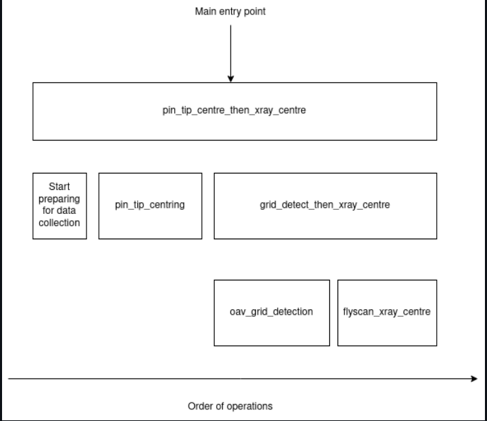

Code map (Outdated)
==================================
The aim of this page is to provide a general overview map of the codebase so that people new to it can find their way around.

Top Level
---------
* ``deploy`` - Folder containing scripts to help deploy Hyperion
* ``fake_zocalo`` - Folder containing scripts that pretend to be a basic zocalo for testing Hyperion
* ``graylog`` - Folder containing scripts for setting up a basic local graylog instance for testing
* ``src`` - Folder containing all code for ``hyperion``


src/mx_bluesky/hyperion
------------------------
Within Hyperion we have the following areas:

- ``device_setup_plans`` - These are very small plans that could be reused across different types of experiments
- ``experiment_plans``` - This is where the bulk of the logic for how to do an experiment lives.
- ``external_interaction`` - Code to interact with any services outside Hyperion (except EPICS devices, for which Hyperion uses dodal).
- ``parameters`` - These are where we define what parameters are passed into Hyperion and used internally.
- ``resources`` - Contains information about plan-dependant configuration for a device. Currently only used for the PandA
- ``__main__`` - The entry point of the program, is responsible for exposing Hyperion so that it can be externally triggered

Plans
------
`Bluesky plans`_ are the way that Hyperion constructs the logic of what to do in an experiment. The generic files in here are:

- ``__init__`` - this lists the plans that are externally visible
- ``experiment_registry`` - this lists how each plan expects to be called

There are then a number of plans for centring the sample:

- ``flyscan_xray_centre_plan`` - triggers a hardware-based grid scan and moves to the xray centre as returned from zocalo
- ``oav_grid_detection_plan`` - optically calculates a grid for a scan that would cover the whole sample
- ``grid_detect_then_xray_centre_plan```` - performs an OAV grid detection then a flyscan xray centre
- ``pin_tip_centring_plan`` - optically finds the tip of the pin and moves to it
- ``pin_centre_then_xray_centre_plan`` - optically centres the pin, then centres using a grid detect and xray centre. Currently this is the main entry point for Hyperion from GDA.
- ``load_centre_collect_full_plan.py`` ...
- ``oav_grid_detection_plan``
- ``oav_snapshot_plan``
- ``robot_load_and_change_energy``
- ``robot_load_then_centre_plan``
- ``rotation_scan_plan``
- ``set_energy_plan``

These call each other in the following way:




Where ``Start preparing for data collection`` is defined in the ``device_setup_plans`` and kicks off long running processes that are needed for xray data collection in the ``flyscan_xray_centre`` phase.
Finally, there are some standalone plans:
- ``stepped_grid_scan_plan`` - performs a software-based grid scan
- ``optimise_attenuation_plan`` - optimises the attenuator based on the fluorescence detector

Flyscan Xray Centre
--------------------
This plan does the following, in roughly this order

1. Move to desired transmission (and turn off xbpm feedback)
2. Move to omega 0
3. Read hardware values for ispyb (a grid scan entry will be added in the background, see here)
4. Setup zebra and motion devices for a grid scan to be done in the motion controller
5. Wait for the Eiger to finish arming or arm the Eiger if it hasn't already been done
6. Run the motion control gridscan
7. Wait for grid scan to end
8. Retrieve the xray centring results from Zocalo (which will be gathered in the background see here)
9. Move to the centre from these results and move the aperture based on the bounding box of the results
10. Move to 100% transmission (and turn on xbpm feedback)


OAV Grid Detection
--------------------
This plan does the following, in roughly this order:

1. Move to omega 0
2. Calculate the 2D grid size using the edge arrays from the OAV
3. Trigger the OAV device to take snapshots, both with and without the grid
4. Read the snapshot paths (which will be gathered for ispyb in the background, see here)
5. Repeat 2-4 for omega 90
6. Return the grid positions

Grid Detect Then Xray Centre
----------------------------
This plan does the following, in roughly this order:

1. If called standalone - start preparing for data collection
2. Do an OAV grid detection
3. Convert the parameters calculated in 2 into something we can send to flyscan xray centre
4. Move the backlight out, set the aperture to small and wait for the detector to finish moving
5. Do a flyscan xray centre

Pin Tip Centre
---------------
This plan does the following, in roughly this order:

1. Configure the oav for image edge detection
2. If we can't find the tip attempt to move it into view by scanning a few large moves in x
3. Move to the tip
4. Rotate omega by 90
5. Move to the tip again

Pin Tip Centre then Xray Centre
--------------------------------
This plan does the following, in roughly this order:

1. Start preparing for data collection (e.g. arm the detector)
2. Do a pin tip centre
3. Do a grid detection then xray centre

Parameters
----------
TBD

External Interactions
----------------------
TBD

.. _Bluesky plans: https://nsls-ii.github.io/bluesky/plans.html: https://www.sphinx-doc.org/
