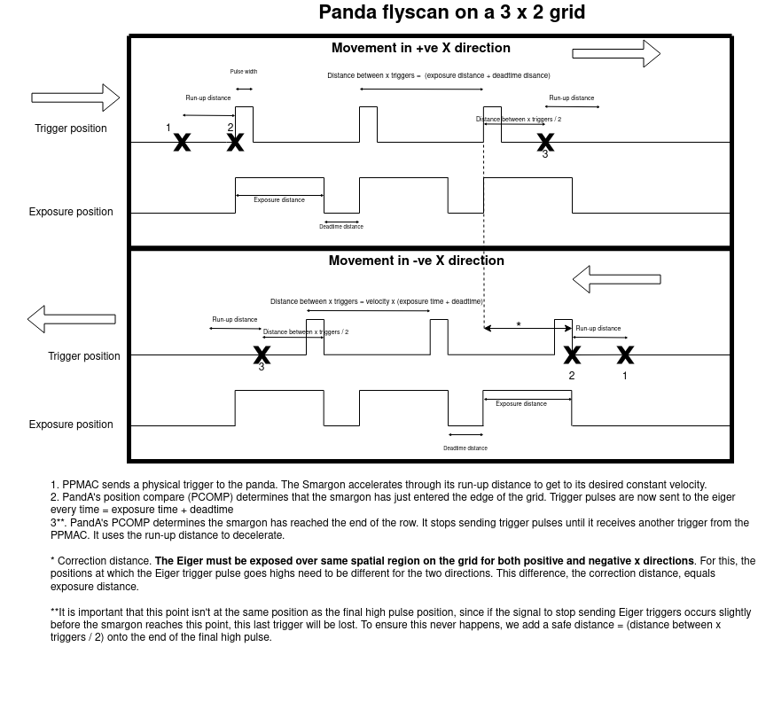

PandA Constant-Motion Scanning
==============================

Definitions
-----------

Fly scan:
    According to the bluesky documentation, a fly scan is a scan which, upon beginning, lets the hardware take control and then waits for a completion message from the hardware. For example, when using Hyperion, the software tells the hardware to 'start grid scans' and then waits for a signal telling it when it has finished.
Slow grid scan:
    A grid scan handled primarily by the software. For example, if hyperion had to manually change all the PV's through the Ophyd layer, this would be a slow grid scan
Constant-motion scan:
    A grid scan where the goniometer moves at a constant velocity through all its rows, and doesn't stop moving upon triggering.
Exposure distance:
    The distance the goniometer moves in the X direction while the detector is being exposed to capture an image
Run-up distance:
    The distance in the X direction given to the goniometer to allow for it to get to its desired velocity. The goniometer travels through its run-up distance before and after the trigger points for that row are sent - this ensures a constant velocity when going across rows within the grid.
Correction distance:
    The difference in trigger positions between the movement in positive and in negative X. This is needed for the detector to always be exposed over the same spatial region. Numerically, it is the same as the exposure distance
Safe distance:
    A value we add onto / takeaway from the final trigger position in the positive / negative X movements. Since encoder counts have a small random fluctuation, this safety barrier ensures that the final trigger point is used before the signal is given to stop sending trigger signals.

Triggering diagram
------------------

Note that the X axis on this diagram can be thought of either in terms of distance or in time, since at constant velocity these only differ by a constant factor. flyscan drawio(4)

PandA Sequencer Table Explanation
---------------------------------

The sequencer table in the Panda contains the triggering logic. It is a repeating 6-stage process:

#. Wait for a physical trigger to be sent from the PPMAC to the PandA - this marks the start of the scan
#. Do a position compare to wait for the goniometer position to enter the grid region (position 2 on the upper half of the triggering diagram). Between steps 1 and 2, the goniometer travels between points 1 and 2 on the upper half of the triggering diagram. Once this point is reached, begin sending triggers at a constant time period, equal to ``exposure time + deadtime``
#. Do another position compare to wait for the goniometer position to get to the end of its grid (plus a ``safe distance``). This point corresponds to position 3 on the upper half of the triggering diagram. Once we reach this point, stop sending periodic trigger signals.
#. Wait for another physical trigger to be sent from the PPMAC to the PandA - this tells the PandA that the scan has now changed direction, so the PandA should start its next position compare.
#. Do a position compare to wait for the goniometer position to go below the end of the grid and then start sending periodic triggers again. Now that the goniometer's position is moving in the opposite direction, this position compare value must include the ``correction distance``. This corresponds to point 2 on the lower half of the triggering diagram
#. Do a position compare to wait for the goniometer position to go below the start of the grid and then stop sending trigger signals. For this position, we need to include the ``safe distance`` and the ``correction distance``. It corresponds to point 3 on the lower half of the triggering diagram. After this, the PandA's sequencer table goes back to step 1 and it will receive another physical trigger to move it on once the goniometer direction as change. This repeats indefinitely until the motion script is complete, and no more of these physical triggers will be sent.

Motion program summary
----------------------
To avoid the sample moving in the opposite direction to what the Panda's position compare is configured to expect, we enforce that the Y steps during the first grid is an even number: For a 3D grid scan, the motion program sets the goniometer to ``X_START`` at the beginning of the first grid, and again for the beginning of the second grid, irrespective of whether the sample ends up at the start of end of the row after its first grid. However, the Panda's position compare isn't configured to distinguish between 2D and 3D grid scans, and assumes the sample always travels in a snake trajectory.
